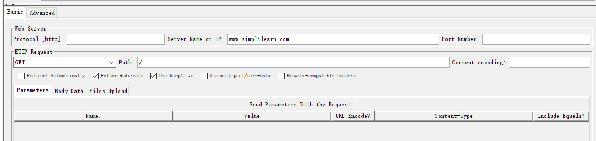

jmeter_test是jmeter的接口测试用例

这个是测试用例的截图
具体是www.simplilearn.com
www.simplilearn.com/resources/
www.simplilearn.com/business/
三个页面分别进行get请求

对数据库进行创建一个基本的测试计划来测试数据库服务器
首先要引入jdbc插件到jmeter中lib下
对应的jar包在test
然后需要一个线程组
线程组需要一个jdbc请求
jdbc请求需要一个jdbc配置
jdbc配置需要一个jdbc驱动
jdbc驱动需要一个数据库连接池
然后结果树，汇总报告 ，聚合报告
https://jmeter.net/usermanual/build-db-test-plan.html
可以参考这篇文章
在下一个字段 Ramp-Up Period 中，保留10 秒的值。该属性告诉 JMeter 在启动每个用户之间延迟多长时间。
例如，如果您输入 10 秒的 Ramp-Up Period，JMeter 将在 10 秒结束时完成启动所有用户。因此，如果我们有 50 个用户和 10 秒的 Ramp-Up Period，
那么启动用户之间的延迟将为 200 毫秒（10 秒 / 50 个用户 = 每个用户 0.2 秒）。如果您将该值设置为 0，那么 JMeter 将立即启动您的所有用户。
最后，在 Loop Count 字段中输入值100 。此属性告诉 JMeter 重复测试多少次。要让 JMeter 重复运行您的测试计划，请选中 Forever 复选框。

第三个
救命！我的老板要我对我们的应用程序进行负载测试！¶
我们预期的平均用户数是多少（正常负载）？

我们预期的用户峰值数量是多少？

什么时候是对我们的应用程序进行负载测试的好时机（即下班时间或周末），记住这很可能会导致我们的一个或多个服务器崩溃？

我们的应用程序有状态吗？如果是这样，我们的应用程序如何管理它（cookie、会话重写或其他方法）？

测试的目的是什么？
（记住 GUI 模式是用于脚本创建和调试，而不是用于负载测试）